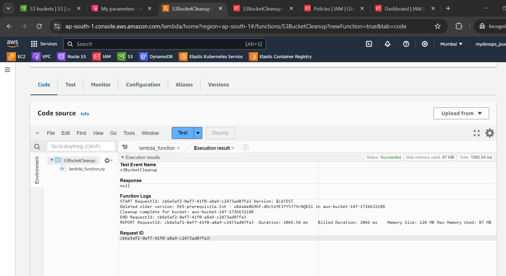
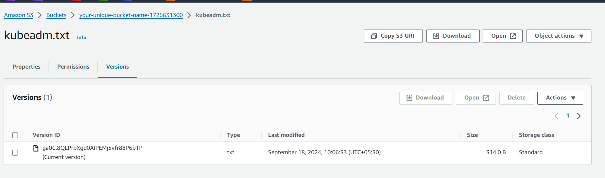

# 🚀 Automating S3 Bucket Cleanup: Simplifying Version Management 🧹

Managing S3 buckets with versioning can get tricky, especially when you're dealing with a huge number of objects and versions! 🌐 But no worries—I've got an easy solution that will help you automate this cleanup process and keep your S3 buckets neat and tidy. 🗂️

## What’s the problem?

If you’re using S3 versioning (which tracks multiple versions of files), you may have noticed that old versions and "delete markers" (created when an object is deleted) pile up over time. ❗ This can quickly increase your storage costs and make your buckets a mess to navigate.

## Solution: Automating Cleanup with a Script!

Here’s a simple way to automate the deletion of all object versions and delete markers, cleaning up your bucket efficiently. 🚀 The script will:

1.Create an S3 bucket with versioning enabled.
2.Upload objects to the bucket.
3.Automate deletion of all versions, delete markers, and even clean up the bucket itself.

## Use Case: Automating S3 Bucket Cleanup

This is ideal for anyone managing large datasets with versioning enabled. It's perfect for keeping costs down and organizing your S3 storage.

## Real-Time Scenario

Imagine you're working with a bucket storing large files or backups, and over time, you’ve accumulated hundreds of versions. Running this script will help you delete unnecessary versions and avoid paying for storage you don’t need! 💸

## Where Is It Used?

1.Cost Optimization: Remove outdated versions to reduce storage costs.
2.Data Management: Keep your bucket clean and organized.
3.Backup & Archival: Clean up old versions while retaining important backups.

## STEPS:

### Step 1: Create an S3 Bucket with Versioning

First, let's create an S3 bucket with versioning enabled.

```bash
#!/bin/bash

BUCKET_NAME="your-unique-bucket-name"

# Create the S3 bucket
aws s3api create-bucket --bucket $BUCKET_NAME --region us-east-1

# Enable versioning on the bucket
aws s3api put-bucket-versioning --bucket $BUCKET_NAME --versioning-configuration Status=Enabled
```


This script creates an S3 bucket and enables versioning, allowing us to keep track of different versions of the objects we upload.

## Step 2: Upload Objects to the Bucket

Next, let's upload some objects to our newly created bucket.


```bash
#!/bin/bash

BUCKET_NAME="your-unique-bucket-name"

# Upload some objects
aws s3 cp file1.txt s3://$BUCKET_NAME/file1.txt
aws s3 cp file2.txt s3://$BUCKET_NAME/file2.txt
```

## Step 3: Delete Objects, Versions, and Delete Markers

The following script automates the deletion of all objects, versions, and delete markers in the bucket.

```bash

#!/bin/bash

bucket_name= "your-aws-bucket-name"

# List all the versions and delete markers
aws s3api list-object-versions --bucket $bucket_name --query 'Versions[].VersionId' --output versions.txt
aws s3api list-object-versions --bucket $bucket_name --query 'DeleteMarkers[].VersionId' --output delete_markers.txt

# Delete all the versions
while IFS=$'\t' read -r key version; do
    if [ -n "$key" ] && [ -n "$version" ]; then
        aws s3api delete-object --bucket "$bucket_name" --key $key --version-id "$version"
    fi  
done < versions.txt


# Delete all the delete markers
while IFS=$'\t' read -r key version; do
    if [ -n "$key" ] && [ -n "$version" ]; then
        aws s3api delete-object --bucket "$bucket_name" --key "$key" --version-id $key --version-id "$version"
    fi
done < delete_markers.txt

# Clean up
rm versions.txt delete_markers.txt

# Delete the S3 bucket
aws s3api delete-bucket --bucket "$bucket_name"
```

### Explanation of the Script

Let's break down what each part of the script does:

### 1.Set the Bucket Name

```bash

 BUCKET_NAME="your-unique-bucket-name"
```

This line defines a variable BUCKET_NAME with the name of the S3 bucket you want to clean up.

### List All Versions and Delete Markers


```bash
 aws s3api list-object-versions --bucket $BUCKET_NAME --query "Versions[].[Key, VersionId]" --output text > versions.txt
 aws s3api list-object-versions --bucket $BUCKET_NAME --query "DeleteMarkers[].[Key, VersionId]" --output text > delete-markers.txt

```

These commands list all the versions and delete markers in the bucket and save the output to two text files: versions.txt and delete-markers.txt. The --query parameter is used to extract the keys and version IDs, and the --output text option formats the output as plain text.


### Delete All Versions

```bash
 while IFS=$'\t' read -r key version; do
   if [ -n "$key" ] && [ -n "$version" ]; then
     aws s3api delete-object --bucket "$BUCKET_NAME" --key "$key" --version-id "$version"
   fi
 done < versions.txt
```

This loop reads each line from versions.txt, extracting the key and version ID. If both values are present, it uses the aws s3api delete-object command to delete the specific version of the object.

### Delete All Delete Markers

```bash
 while IFS=$'\t' read -r key version; do
   if [ -n "$key" ] && [ -n "$version" ]; then
     aws s3api delete-object --bucket "$BUCKET_NAME" --key "$key" --version-id "$version"
   fi
 done < delete-markers.txt
```


Similar to the previous loop, this loop reads from delete-markers.txt and deletes each delete marker found.

### Clean Up

```bash
 rm versions.txt delete-markers.txt

```

This command removes the temporary files versions.txt and delete-markers.txt to clean up after the script runs.

### Delete the Bucket


```bash
 aws s3api delete-bucket --bucket "$BUCKET_NAME"

```
Finally, this command deletes the now-empty S3 bucket.

## Purpose and Use Case

Managing S3 buckets with versioning enabled can lead to a large number of object versions and delete markers. This script provides a simple and effective way to clean up these objects, making it ideal for scenarios where you need to manage storage costs or reorganize your bucket structure. By automating the deletion process, you can ensure that your bucket remains organized and free from unnecessary versions and delete markers.

# Conclusion

In this blog post, we covered how to create an S3 bucket with versioning, upload objects, and use a script to delete all objects, versions, and delete markers. This script is particularly useful for managing large numbers of objects and maintaining an organized bucket structure.

Feel free to customize and adapt the script to suit your specific needs, and happy cleaning!


## AWS lambda using python

Python code for the script is available [here](./s3-cleanup-script.py)

# Final Screenshots of the project








